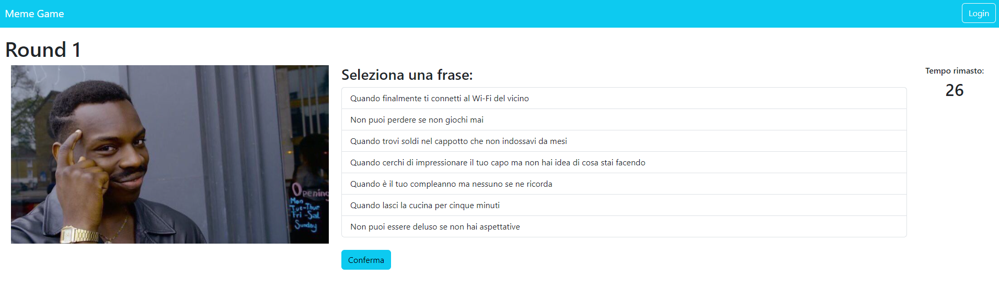
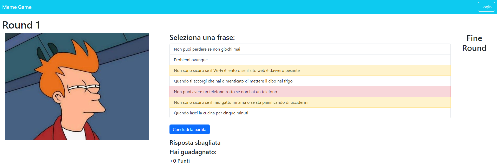

[](https://classroom.github.com/a/J0Dv0VMM)
# Exam #1: "Gioco dei Meme"
## Student: s322359 CIANCIA NICOLA 

## React Client Application Routes

- Route `/`: Main page where the game can be started
- Route `/login`: Page for the login
- Route `/history`: Shows the history of every played round by the logged user
- Route `/match`: Includes rounds and summary for logged users

## API Server

### API Users

- POST `/api/session`
  - Description: Handle user login.
  - No parameters
  - Request body:
  ```
  {
    "username": "user",
    "password": "testpass"
  }
  ```
  - Response: `200 OK` (success) or `401 Unauthorized` (wrong credentials).
  - Response body:
  ```
  {
    "id": 1,
    "username": "user",
    "name": "Mario"
  }
  ```

- GET `/api/session`
  - Description: Check if user is logged-in.
  - No request body or parameters.
  - Response: `200 OK` (success) or `401 Unauthorized` (not logged id).
  - Response body:
  ```
  {
    "id": 1,
    "username": "user",
    "name": "Mario"
  }
  ```


- DELETE `/api/session`
  - Description: Handle logout.
  - No request body, response body or parameters.
  - Response: `200 OK` (success).

### API Meme

- GET `/api/images/pick`
  - Description: Retrieve **1** image to prepare the match,
  - No request body or parameters.
  - Response: `200 OK` (success) or `500 Internal Server Error` (generic error).
  - Response body:
  ```
  {
    "imageId": 1,
    "path": "Futurama-Fry.jpg"
  }
  ```

- GET `/api/images`
  - Description: Retrieve **3** images to prepare the match (Only logged users).
  - No request body or parameters.
  - Response: `200 OK` (success), `401 Unauthorized` (not logged id) or `500 Internal Server Error` (generic error).
  - Response body:
  ```
  [
    {
      "imageId": 1,
      "path": "Futurama-Fry.jpg"
    },
    ...
  ]
  ```

- GET `/api/images/<imageId>/captions`
  - Description: Retrieve **7** captions (a deck) based on the image `<imageID>` given.
  - No request body, `<imageID>` as parameter.
  - Response: `200 OK` (success), `404 Not found` (wrong id) or `500 Internal Server Error` (generic error). 
  - Response body:
  ```
  [
    {
      "captionId": 1,
      "text": "Non sono sicuro se il Wi-Fi è lento o se il sito web è davvero pesante"
    },
    ...
  ]
  ```

- POST `/api/images/<imageId>/captions`
  - Description: Search for the correct captions
  - Parameter: `<imageId>`
  - Request body:
  ```
  [8, 10, 11, 7, 5, 1, 3]
  ```
  - Response: `200 OK` (success), `404 Not found` (wrong id), `503 Service Unavailable` (generic error). If the request body is not valid, `400 Bad Request` (validation error).
  - Response body:
  ```
  [1, 3]
  ```

- GET `/api/history`
  - Description: Retrieve the history of played matches (Only logged users).
  - No request body or parameters.
  - Response: `200 OK` (success), `401 Unauthorized` (not logged id) or `500 Internal Server Error` (generic error).
  - Response body:
  ```
  [
    {
      "historyId": 1,
      "points": 15,
      "date": "2024-06-28"
    },
    ...
  ]
  ```

- GET `/api/history/<id>`
  - Description: Retrieve informations about the selected played match (Only logged users).
  - No request body, `<id>` as parameter.
  - Response: `200 OK` (success), `401 Unauthorized` (not logged id), `404 Not found` (wrong id) or `500 Internal Server Error` (generic error).
  - Response body:
  ```
  [
    {
      "imageId": 1,
      "path": "Futurama-Fry.jpg",
      "isCorrect": true 
    },
    ...
  ]
  ```

- POST `/api/history`
  - Description: Save played match in the hystory (Only logged users).
  - Request body:
  ```
  [
    {
      "imageId": 1,
      "isCorrect": true 
    },
    ...
  ]
  ```
  - Response:  Response: `201 Created` (success), `401 Unauthorized` (not logged id) or `503 Service Unavailable` (generic error). If the request body is not valid, `400 Bad Request` (validation error).
  - No response body and no parameters

## Database Tables

- Table `users` - contains: **id**, name, username, password, salt
- Table `images` - contains: **id**, path
- Table `captions` - contains: **id**, captionText
- Table `memes` - contains: **id**, *imageId*, *captionId*
- Table `history` - contains: **id**, *userId*, date, points
- Table `rounds` - contains: **id**, *historyId*, *imageId*, isCorrect

## Main React Components

- `StartLayout` (in `StartLayout.jsx`): component used as a layout for the main page. Contains logo and match button.
- `NavHeader` (in `NavHeader.jsx`): component used as a layout for the navbar. Contains buttons for login, logout and history.
- `LoginForm` (in `Auth.jsx`): component for login handling. It requires username and password.
- `LogoutButton` (in `Auth.jsx`): button used to execute logout.
- `LoginButton` (in `Auth.jsx`): button to navigate to the login form.
- `MatchLayout` (in `MatchLayout.jsx`): component used as a layout for the match page. It contains round and summary and stores details about the match.
- `Round` (in `MatchLayout.jsx`): component that shows the current round. It contains the image, the cations with related informations, and the timer.
- `Summary` (in `MatchLayout.jsx`): component that shows the summary of the match. It shows correct captions and points previously stored by the match.
- `MatchButton` (in `MatchLayout.jsx`): button to navigate to the match.
- `Timer` (in `Timer.jsx`): component for timer handling.
- `HistoryLayout` (in `HistoryLayout.jsx`): component used as a layout for the match page. Shows the list of played matches from last to first.
- `HistoryButton` (in `HistoryLayout.jsx`): button to navigate to the history.
- `NotFound` (in `NotFoundComponent.jsx`): component used to handle invalid paths

## Screenshot




## Users Credentials

- user, testpass
- prova, prova
